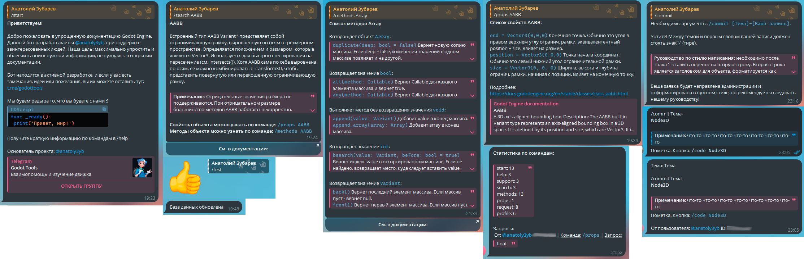
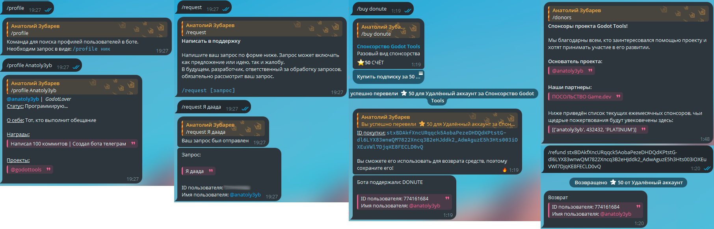

# Простой бот документации по Godot Engine

Бот, который создается, чтобы помогать! Упрощает взаимодействовать с документацией Godot Engine, и не только. 

## Краткая суть:
Бот написан на Python, используя минимальное количество библиотек (подробнее ниже). Имеет несколько команд, ответы на которые достает из заранее написанного JSON файла. Имеет функционал для принятия доната в виде Telegram Stars. Имеется база данных для аналитики и списка спонсоров. Имеет banlist. Монолитная архитектура

## Команды:

| Команды         | Аргумен                    | Описание                     | Файл            |
| :------------   |:---------------            |:-----                        |:-----           |
| /start          | null                       | Приветствие                  | handlers.py     |
| /help           | null                       | Подсказка по командам        | handlers.py     |
| /search         | node_name: String          | Краткая информ. по запросу   | handlers.py     |
| /methods        | method_name: String        | Краткая информ. по запросу   | handlers.py     |
| /props          | props_name: String         | Краткая информ. по запросу   | handlers.py     |
| /test           | null                       | Эмодзи                       | dev.py          |
| /jsonUpdate     | null                       | Сообщение о обновлении БД    | dev.py          |
| /stats          | null                       | Статистика по командам       | dev.py          |
| /send           | userId: int, answer: String| Отправить сообщ. пользователю| dev.py          |
| /commit         | theme: String, text: String| Отправить запрос c темой в БД| dev.py          |
| /profile        | username: String           | Информация о профиле пользов.| profile.py      |
| /request        | text: String               | Отправить запрос в БД        | request.py      |
| /buy            | subs_name: String          | Список подписок и цен        | donute.py       |
| /refund         | purchase_ID: int           | Вернуть потраченные Stars    | donute.py       |
| /donors         | null                       | Список спонсоров (Доделать)  | handlers.py     |

# Примеры ответов

# Requirements.txt
1. aiofiles==24.1.0
2. aiogram==3.21.0
3. aiohappyeyeballs==2.6.1
4. aiohttp==3.11.18
5. aiosignal==1.3.2
6. annotated-types==0.7.0
7. attrs==25.3.0
8. certifi==2025.6.15
9. frozenlist==1.7.0
10. idna==3.10
11. magic-filter==1.0.12
12. multidict==6.5.0
13. propcache==0.3.2
14. pydantic==2.11.7
15. pydantic_core==2.33.2
16. typing-inspection==0.4.1
17. typing_extensions==4.14.0
18. yarl==1.20.1
